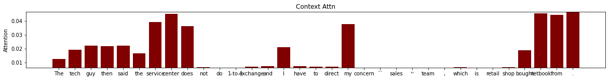

# Sentiment-Analysis-Using-Interactive-Attention-Networks

## Evaluation Metrics
### Attention Model
|Dataset|Train Loss|Test Loss|Train Acc|Test Acc|
|---|---|---|---|----|
|Laptop|0.575|0.776|0.834|0.7152|
|Restaurant|0.498|0.674|0.881|0.781|

### Non Attention Model
|Dataset|Train Loss|Test Loss|Train Acc|Test Acc|
|---|---|---|---|----|
|Laptop|0.841|0.880|0.653|0.608|
|Restaurant|0.789|0.747|0.652|0.719|

## Attention Weights
### Laptop

Aspect Attn |Context Attn|
:-------------|:-----------|
||
||
||
||
||

### Restaurant
Aspect Attn |Context Attn|
:-------------|:-----------|
||
||
||
||
||

## Reference
1. [https://www.ijcai.org/proceedings/2017/0568.pdf](https://www.ijcai.org/proceedings/2017/0568.pdf)
